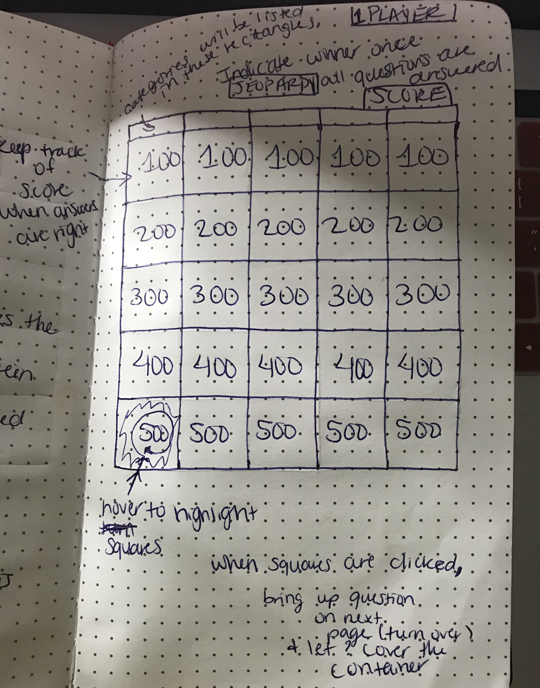

# JeopardyGame

This is a simple game of Jeopardy.

# Object of the game

A single player must answer questions correctly in order to have points added, and ultimately win the game. If player answers questions incorrectly, points are deducted. The score is kept in the top, left corner.

# Whiteboard/Wireframing

# Link to game:
https://sekoyahicks.github.io/JeopardyGame/

# Link to Trello/Project Board
https://trello.com/b/6w2T6Q4P/sei-project-1
